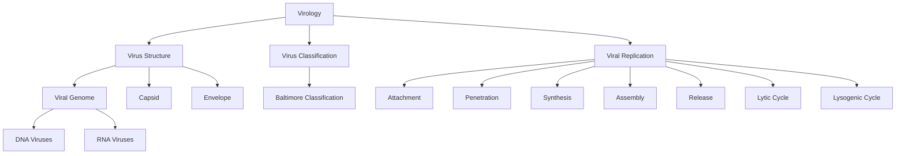

```mermaid
flowchart TD
    Virology --> VS[Virus Structure]
    Virology --> VC[Virus Classification]
    Virology --> Rep[Viral Replication]

    VS --> Genome[Viral Genome]
    VS --> Capsid[Capsid]
    VS --> Envelope[Envelope]

    Genome --> DNA[DNA Viruses]
    Genome --> RNA[RNA Viruses]

    VC --> Baltimore[Baltimore Classification]

    Rep --> Attachment[Attachment]
    Rep --> Penetration[Penetration]
    Rep --> Synthesis[Synthesis]
    Rep --> Assembly[Assembly]
    Rep --> Release[Release]

    Rep --> Lytic[Lytic Cycle]
    Rep --> Lysogenic[Lysogenic Cycle]
```
