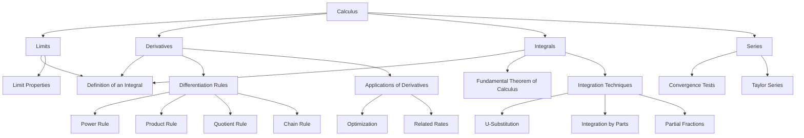

```mermaid
flowchart TD
    Calculus --> Limits[Limits]
    Calculus --> Derivatives[Derivatives]
    Calculus --> Integrals[Integrals]
    Calculus --> Series[Series]

    Limits --> Definition[Epsilon-Delta Definition]
    Limits --> Properties[Limit Properties]

    Derivatives --> Definition[Definition of a Derivative]
    Derivatives --> Rules[Differentiation Rules]
    Derivatives --> Applications[Applications of Derivatives]

    Rules --> Power[Power Rule]
    Rules --> Product[Product Rule]
    Rules --> Quotient[Quotient Rule]
    Rules --> Chain[Chain Rule]

    Applications --> Optimization[Optimization]
    Applications --> RelatedRates[Related Rates]

    Integrals --> Definition[Definition of an Integral]
    Integrals --> FTC[Fundamental Theorem of Calculus]
    Integrals --> Techniques[Integration Techniques]

    Techniques --> Substitution[U-Substitution]
    Techniques --> ByParts[Integration by Parts]
    Techniques --> PartialFractions[Partial Fractions]

    Series --> Convergence[Convergence Tests]
    Series --> Taylor[Taylor Series]
```
