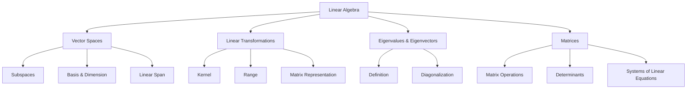

```mermaid
flowchart TD
    LA[Linear Algebra] --> VS[Vector Spaces]
    LA --> LT[Linear Transformations]
    LA --> E[Eigenvalues & Eigenvectors]
    LA --> M[Matrices]

    VS --> Subspaces[Subspaces]
    VS --> Basis[Basis & Dimension]
    VS --> Span[Linear Span]

    LT --> Kernel[Kernel]
    LT --> Range[Range]
    LT --> MatrixRep[Matrix Representation]

    E --> Definition[Definition]
    E --> Diagonalization[Diagonalization]

    M --> Operations[Matrix Operations]
    M --> Determinants[Determinants]
    M --> Systems[Systems of Linear Equations]
```
