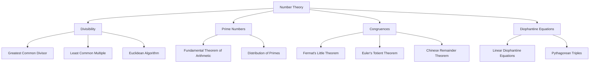

```mermaid
flowchart TD
    NT[Number Theory] --> Divisibility[Divisibility]
    NT --> Primes[Prime Numbers]
    NT --> Congruences[Congruences]
    NT --> DE[Diophantine Equations]

    Divisibility --> GCD[Greatest Common Divisor]
    Divisibility --> LCM[Least Common Multiple]
    Divisibility --> EA[Euclidean Algorithm]

    Primes --> FTA[Fundamental Theorem of Arithmetic]
    Primes --> Distribution[Distribution of Primes]

    Congruences --> FLT[Fermat's Little Theorem]
    Congruences --> ET[Euler's Totient Theorem]
    Congruences --> CRT[Chinese Remainder Theorem]

    DE --> Linear[Linear Diophantine Equations]
    DE --> Pythagorean[Pythagorean Triples]
```
