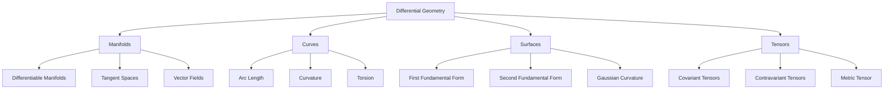

```mermaid
flowchart TD
    DG[Differential Geometry] --> Manifolds[Manifolds]
    DG --> Curves[Curves]
    DG --> Surfaces[Surfaces]
    DG --> Tensors[Tensors]

    Manifolds --> Differentiable[Differentiable Manifolds]
    Manifolds --> Tangent[Tangent Spaces]
    Manifolds --> VectorFields[Vector Fields]

    Curves --> ArcLength[Arc Length]
    Curves --> Curvature[Curvature]
    Curves --> Torsion[Torsion]

    Surfaces --> FirstFF[First Fundamental Form]
    Surfaces --> SecondFF[Second Fundamental Form]
    Surfaces --> Gaussian[Gaussian Curvature]

    Tensors --> Covariant[Covariant Tensors]
    Tensors --> Contravariant[Contravariant Tensors]
    Tensors --> Metric[Metric Tensor]
```
