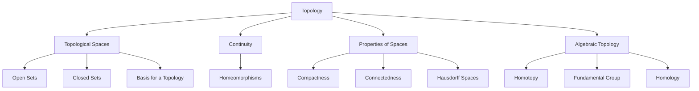

```mermaid
flowchart TD
    Topology --> TS[Topological Spaces]
    Topology --> C[Continuity]
    Topology --> P[Properties of Spaces]
    Topology --> AT[Algebraic Topology]

    TS --> OpenSets[Open Sets]
    TS --> ClosedSets[Closed Sets]
    TS --> Basis[Basis for a Topology]

    C --> Homeomorphisms[Homeomorphisms]

    P --> Compactness[Compactness]
    P --> Connectedness[Connectedness]
    P --> Hausdorff[Hausdorff Spaces]

    AT --> Homotopy[Homotopy]
    AT --> FundamentalGroup[Fundamental Group]
    AT --> Homology[Homology]
```
