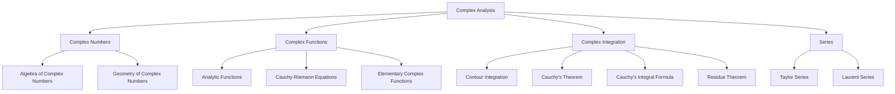

```mermaid
flowchart TD
    CA[Complex Analysis] --> CN[Complex Numbers]
    CA --> CF[Complex Functions]
    CA --> CI[Complex Integration]
    CA --> S[Series]

    CN --> Algebra[Algebra of Complex Numbers]
    CN --> Geometry[Geometry of Complex Numbers]

    CF --> Analytic[Analytic Functions]
    CF --> CRE[Cauchy-Riemann Equations]
    CF --> Elementary[Elementary Complex Functions]

    CI --> Contour[Contour Integration]
    CI --> CT[Cauchy's Theorem]
    CI --> CIF[Cauchy's Integral Formula]
    CI --> Residue[Residue Theorem]

    S --> Taylor[Taylor Series]
    S --> Laurent[Laurent Series]
```
