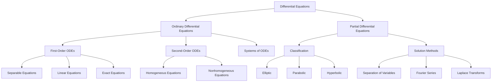

```mermaid
flowchart TD
    DE[Differential Equations] --> ODE[Ordinary Differential Equations]
    DE --> PDE[Partial Differential Equations]

    ODE --> FirstOrder[First-Order ODEs]
    ODE --> SecondOrder[Second-Order ODEs]
    ODE --> Systems[Systems of ODEs]

    FirstOrder --> Separable[Separable Equations]
    FirstOrder --> Linear[Linear Equations]
    FirstOrder --> Exact[Exact Equations]

    SecondOrder --> Homogeneous[Homogeneous Equations]
    SecondOrder --> Nonhomogeneous[Nonhomogeneous Equations]

    PDE --> Classification[Classification]
    PDE --> Methods[Solution Methods]

    Classification --> Elliptic[Elliptic]
    Classification --> Parabolic[Parabolic]
    Classification --> Hyperbolic[Hyperbolic]

    Methods --> Separation[Separation of Variables]
    Methods --> Fourier[Fourier Series]
    Methods --> Laplace[Laplace Transforms]
```
