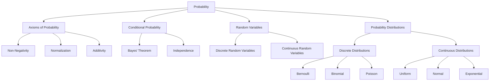

```mermaid
flowchart TD
    Probability --> Axioms[Axioms of Probability]
    Probability --> CP[Conditional Probability]
    Probability --> RV[Random Variables]
    Probability --> PD[Probability Distributions]

    Axioms --> NonNegativity[Non-Negativity]
    Axioms --> Normalization[Normalization]
    Axioms --> Additivity[Additivity]

    CP --> Bayes[Bayes' Theorem]
    CP --> Independence[Independence]

    RV --> Discrete[Discrete Random Variables]
    RV --> Continuous[Continuous Random Variables]

    PD --> DiscreteD[Discrete Distributions]
    PD --> ContinuousD[Continuous Distributions]

    DiscreteD --> Bernoulli[Bernoulli]
    DiscreteD --> Binomial[Binomial]
    DiscreteD --> Poisson[Poisson]

    ContinuousD --> Uniform[Uniform]
    ContinuousD --> Normal[Normal]
    ContinuousD --> Exponential[Exponential]
```
