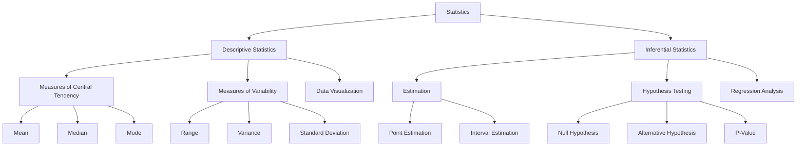

```mermaid
flowchart TD
    Statistics --> DS[Descriptive Statistics]
    Statistics --> IS[Inferential Statistics]

    DS --> CentralTendency[Measures of Central Tendency]
    DS --> Variability[Measures of Variability]
    DS --> Visualization[Data Visualization]

    CentralTendency --> Mean[Mean]
    CentralTendency --> Median[Median]
    CentralTendency --> Mode[Mode]

    Variability --> Range[Range]
    Variability --> Variance[Variance]
    Variability --> SD[Standard Deviation]

    IS --> Estimation[Estimation]
    IS --> Hypothesis[Hypothesis Testing]
    IS --> Regression[Regression Analysis]

    Estimation --> Point[Point Estimation]
    Estimation --> Interval[Interval Estimation]

    Hypothesis --> Null[Null Hypothesis]
    Hypothesis --> Alternative[Alternative Hypothesis]
    Hypothesis --> PValue[P-Value]
```
