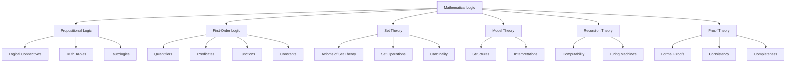

```mermaid
flowchart TD
    ML[Mathematical Logic] --> PL[Propositional Logic]
    ML --> FOL[First-Order Logic]
    ML --> ST[Set Theory]
    ML --> MT[Model Theory]
    ML --> RT[Recursion Theory]
    ML --> PT[Proof Theory]

    PL --> Connectives[Logical Connectives]
    PL --> TruthTables[Truth Tables]
    PL --> Tautologies[Tautologies]

    FOL --> Quantifiers[Quantifiers]
    FOL --> Predicates[Predicates]
    FOL --> Functions[Functions]
    FOL --> Constants[Constants]

    ST --> Axioms[Axioms of Set Theory]
    ST --> Operations[Set Operations]
    ST --> Cardinality[Cardinality]

    MT --> Structures[Structures]
    MT --> Interpretations[Interpretations]

    RT --> Computability[Computability]
    RT --> Turing[Turing Machines]

    PT --> Formal[Formal Proofs]
    PT --> Consistency[Consistency]
    PT --> Completeness[Completeness]
```
