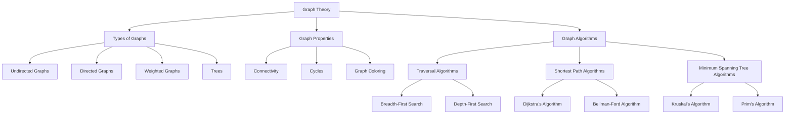

```mermaid
flowchart TD
    GT[Graph Theory] --> Graphs[Types of Graphs]
    GT --> Properties[Graph Properties]
    GT --> Algorithms[Graph Algorithms]

    Graphs --> Undirected[Undirected Graphs]
    Graphs --> Directed[Directed Graphs]
    Graphs --> Weighted[Weighted Graphs]
    Graphs --> Trees[Trees]

    Properties --> Connectivity[Connectivity]
    Properties --> Cycles[Cycles]
    Properties --> Coloring[Graph Coloring]

    Algorithms --> Traversal[Traversal Algorithms]
    Algorithms --> ShortestPath[Shortest Path Algorithms]
    Algorithms --> MST[Minimum Spanning Tree Algorithms]

    Traversal --> BFS[Breadth-First Search]
    Traversal --> DFS[Depth-First Search]

    ShortestPath --> Dijkstra[Dijkstra's Algorithm]
    ShortestPath --> BellmanFord[Bellman-Ford Algorithm]

    MST --> Kruskal[Kruskal's Algorithm]
    MST --> Prim[Prim's Algorithm]
```
