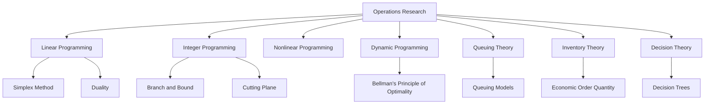

```mermaid
flowchart TD
    OR[Operations Research] --> LP[Linear Programming]
    OR --> IP[Integer Programming]
    OR --> NLP[Nonlinear Programming]
    OR --> DP[Dynamic Programming]
    OR --> QT[Queuing Theory]
    OR --> IT[Inventory Theory]
    OR --> DT[Decision Theory]

    LP --> Simplex[Simplex Method]
    LP --> Duality[Duality]

    IP --> BranchAndBound[Branch and Bound]
    IP --> CuttingPlane[Cutting Plane]

    DP --> Bellman[Bellman's Principle of Optimality]

    QT --> Models[Queuing Models]

    IT --> EOQ[Economic Order Quantity]

    DT --> DecisionTrees[Decision Trees]
```
