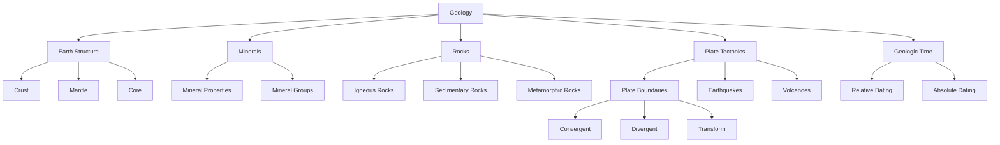

```mermaid
flowchart TD
    Geology --> Earth[Earth Structure]
    Geology --> Minerals[Minerals]
    Geology --> Rocks[Rocks]
    Geology --> PT[Plate Tectonics]
    Geology --> GST[Geologic Time]

    Earth --> Crust[Crust]
    Earth --> Mantle[Mantle]
    Earth --> Core[Core]

    Minerals --> Properties[Mineral Properties]
    Minerals --> Groups[Mineral Groups]

    Rocks --> Igneous[Igneous Rocks]
    Rocks --> Sedimentary[Sedimentary Rocks]
    Rocks --> Metamorphic[Metamorphic Rocks]

    PT --> Boundaries[Plate Boundaries]
    PT --> Earthquakes[Earthquakes]
    PT --> Volcanoes[Volcanoes]

    Boundaries --> Convergent[Convergent]
    Boundaries --> Divergent[Divergent]
    Boundaries --> Transform[Transform]

    GST --> Relative[Relative Dating]
    GST --> Absolute[Absolute Dating]
```
