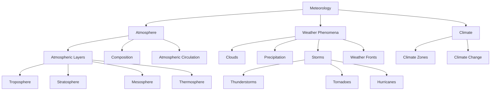

```mermaid
flowchart TD
    Meteorology --> Atmosphere[Atmosphere]
    Meteorology --> Weather[Weather Phenomena]
    Meteorology --> Climate[Climate]

    Atmosphere --> Layers[Atmospheric Layers]
    Atmosphere --> Composition[Composition]
    Atmosphere --> Circulation[Atmospheric Circulation]

    Layers --> Troposphere[Troposphere]
    Layers --> Stratosphere[Stratosphere]
    Layers --> Mesosphere[Mesosphere]
    Layers --> Thermosphere[Thermosphere]

    Weather --> Clouds[Clouds]
    Weather --> Precipitation[Precipitation]
    Weather --> Storms[Storms]
    Weather --> Fronts[Weather Fronts]

    Storms --> Thunderstorms[Thunderstorms]
    Storms --> Tornadoes[Tornadoes]
    Storms --> Hurricanes[Hurricanes]

    Climate --> Zones[Climate Zones]
    Climate --> Change[Climate Change]
```
