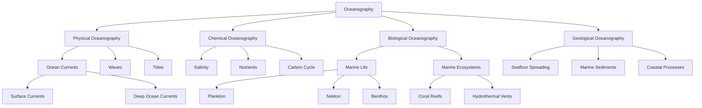

```mermaid
flowchart TD
    Oceanography --> Physical[Physical Oceanography]
    Oceanography --> Chemical[Chemical Oceanography]
    Oceanography --> Biological[Biological Oceanography]
    Oceanography --> Geological[Geological Oceanography]

    Physical --> Currents[Ocean Currents]
    Physical --> Waves[Waves]
    Physical --> Tides[Tides]

    Currents --> Surface[Surface Currents]
    Currents --> Deep[Deep Ocean Currents]

    Chemical --> Salinity[Salinity]
    Chemical --> Nutrients[Nutrients]
    Chemical --> CarbonCycle[Carbon Cycle]

    Biological --> MarineLife[Marine Life]
    Biological --> Ecosystems[Marine Ecosystems]

    MarineLife --> Plankton[Plankton]
    MarineLife --> Nekton[Nekton]
    MarineLife --> Benthos[Benthos]

    Ecosystems --> CoralReefs[Coral Reefs]
    Ecosystems --> HydrothermalVents[Hydrothermal Vents]

    Geological --> Seafloor[Seafloor Spreading]
    Geological --> Sediments[Marine Sediments]
    Geological --> Coasts[Coastal Processes]
```
