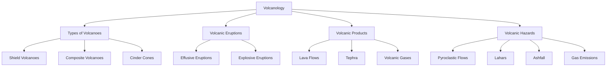

```mermaid
flowchart TD
    Volcanology --> Volcanoes[Types of Volcanoes]
    Volcanology --> Eruptions[Volcanic Eruptions]
    Volcanology --> Products[Volcanic Products]
    Volcanology --> Hazards[Volcanic Hazards]

    Volcanoes --> Shield[Shield Volcanoes]
    Volcanoes --> Composite[Composite Volcanoes]
    Volcanoes --> Cinder[Cinder Cones]

    Eruptions --> Effusive[Effusive Eruptions]
    Eruptions --> Explosive[Explosive Eruptions]

    Products --> Lava[Lava Flows]
    Products --> Tephra[Tephra]
    Products --> Gases[Volcanic Gases]

    Hazards --> Pyroclastic[Pyroclastic Flows]
    Hazards --> Lahars[Lahars]
    Hazards --> Ashfall[Ashfall]
    Hazards --> Gas[Gas Emissions]
```
