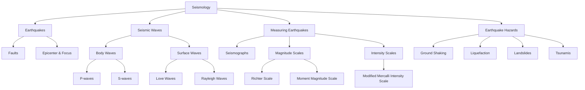

```mermaid
flowchart TD
    Seismology --> Earthquakes[Earthquakes]
    Seismology --> Waves[Seismic Waves]
    Seismology --> Measurement[Measuring Earthquakes]
    Seismology --> Hazards[Earthquake Hazards]

    Earthquakes --> Faults[Faults]
    Earthquakes --> Epicenter[Epicenter & Focus]

    Waves --> Body[Body Waves]
    Waves --> Surface[Surface Waves]

    Body --> Pwaves[P-waves]
    Body --> Swaves[S-waves]

    Surface --> Love[Love Waves]
    Surface --> Rayleigh[Rayleigh Waves]

    Measurement --> Seismographs[Seismographs]
    Measurement --> Magnitude[Magnitude Scales]
    Measurement --> Intensity[Intensity Scales]

    Magnitude --> Richter[Richter Scale]
    Magnitude --> Moment[Moment Magnitude Scale]

    Intensity --> MMI[Modified Mercalli Intensity Scale]

    Hazards --> GroundShaking[Ground Shaking]
    Hazards --> Liquefaction[Liquefaction]
    Hazards --> Landslides[Landslides]
    Hazards --> Tsunamis[Tsunamis]
```
