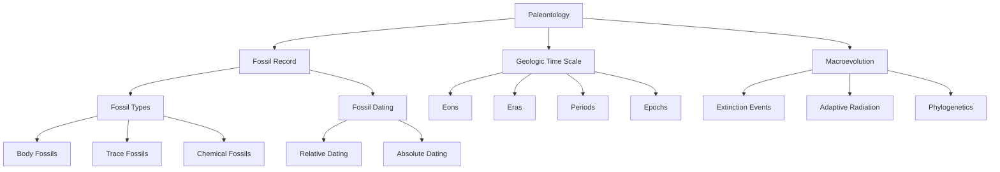

```mermaid
flowchart TD
    Paleontology --> Fossils[Fossil Record]
    Paleontology --> GeologicTime[Geologic Time Scale]
    Paleontology --> Macroevolution[Macroevolution]

    Fossils --> Types[Fossil Types]
    Fossils --> Dating[Fossil Dating]

    Types --> Body[Body Fossils]
    Types --> Trace[Trace Fossils]
    Types --> Chemical[Chemical Fossils]

    Dating --> Relative[Relative Dating]
    Dating --> Absolute[Absolute Dating]

    GeologicTime --> Eons[Eons]
    GeologicTime --> Eras[Eras]
    GeologicTime --> Periods[Periods]
    GeologicTime --> Epochs[Epochs]

    Macroevolution --> Extinction[Extinction Events]
    Macroevolution --> AdaptiveRadiation[Adaptive Radiation]
    Macroevolution --> Phylogenetics[Phylogenetics]
```
