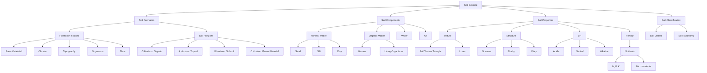

```mermaid
flowchart TD
 SOIL[Soil Science] --> FORM[Soil Formation]
 SOIL --> COMP[Soil Components]
 SOIL --> PROP[Soil Properties]

 FORM --> FACTOR[Formation Factors]
 FORM --> HORIZONS[Soil Horizons]

 FACTOR --> PARENT[Parent Material]
 FACTOR --> CLIMATE[Climate]
 FACTOR --> TOPO[Topography]
 FACTOR --> ORG[Organisms]
 FACTOR --> TIME[Time]

 HORIZONS --> O[O Horizon: Organic]
 HORIZONS --> A[A Horizon: Topsoil]
 HORIZONS --> B[B Horizon: Subsoil]
 HORIZONS --> C[C Horizon: Parent Material]

 COMP --> MINERAL[Mineral Matter]
 COMP --> ORGANIC[Organic Matter]
 COMP --> WATER[Water]
 COMP --> AIR[Air]

 MINERAL --> SAND[Sand]
 MINERAL --> SILT[Silt]
 MINERAL --> CLAY[Clay]

 ORGANIC --> HUMUS[Humus]
 ORGANIC --> LIVING[Living Organisms]

 PROP --> TEXT[Texture]
 PROP --> STRUCT[Structure]
 PROP --> PH[pH]
 PROP --> FERT[Fertility]

 TEXT --> TRIANGLE[Soil Texture Triangle]
 TEXT --> LOAM[Loam]

 STRUCT --> GRANULAR[Granular]
 STRUCT --> BLOCKY[Blocky]
 STRUCT --> PLATY[Platy]

 PH --> ACID[Acidic]
 PH --> NEUTRAL[Neutral]
 PH --> ALKALINE[Alkaline]

 FERT --> NUTRI[Nutrients]
 NUTRI --> NPK[N, P, K]
 NUTRI --> MICRO[Micronutrients]

 SOIL --> CLASS[Soil Classification]
 CLASS --> ORDERS[Soil Orders]
 CLASS --> TAX[Soil Taxonomy]
```
