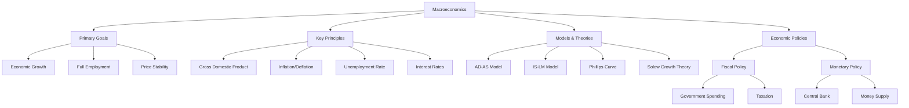

```mermaid
flowchart TD
    MACRO[Macroeconomics] --> GOALS[Primary Goals]
    MACRO --> KP[Key Principles]
    MACRO --> MOD[Models & Theories]
    MACRO --> POL[Economic Policies]

    GOALS --> EG[Economic Growth]
    GOALS --> FE[Full Employment]
    GOALS --> PS[Price Stability]

    KP --> GDP[Gross Domestic Product]
    KP --> INF[Inflation/Deflation]
    KP --> UNE[Unemployment Rate]
    KP --> IR[Interest Rates]

    MOD --> ADAS[AD-AS Model]
    MOD --> ISLM[IS-LM Model]
    MOD --> PC[Phillips Curve]
    MOD --> ST[Solow Growth Theory]

    POL --> FP[Fiscal Policy]
    POL --> MP[Monetary Policy]

    FP --> GOV[Government Spending]
    FP --> TAX[Taxation]
    MP --> CB[Central Bank]
    MP --> MS[Money Supply]
```
