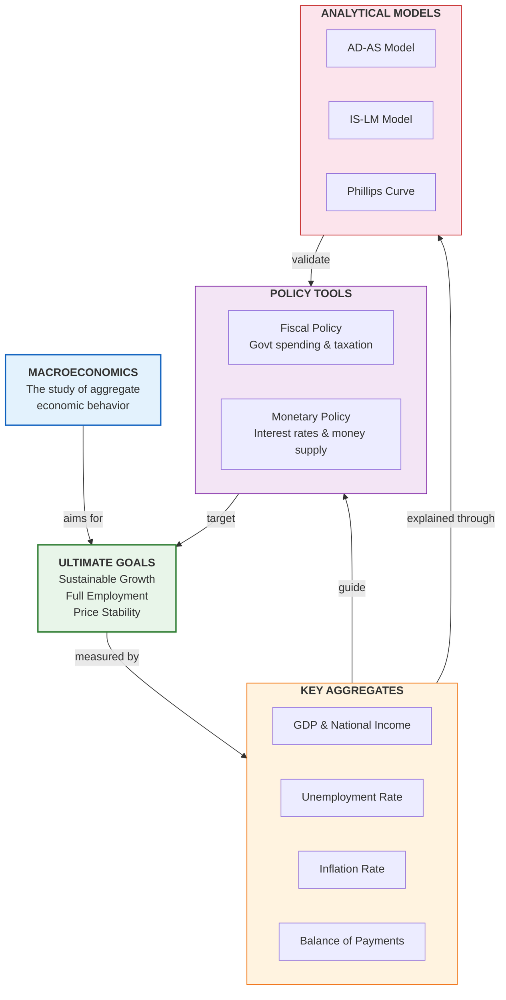

```mermaid
flowchart TD
    A[<b>MACROECONOMICS</b><br>The study of aggregate<br>economic behavior]:::title
    B[<b>ULTIMATE GOALS</b><br>Sustainable Growth<br>Full Employment<br>Price Stability]:::goals
    subgraph aggregates [<b>KEY AGGREGATES</b>]
        C1[GDP & National Income]
        C2[Unemployment Rate]
        C3[Inflation Rate]
        C4[Balance of Payments]
    end
    subgraph policies [<b>POLICY TOOLS</b>]
        D1[Fiscal Policy<br>Govt spending & taxation]
        D2[Monetary Policy<br>Interest rates & money supply]
    end
    subgraph models [<b>ANALYTICAL MODELS</b>]
        E1[AD-AS Model]
        E2[IS-LM Model]
        E3[Phillips Curve]
    end
    A -->|aims for| B
    B -->|measured by| aggregates
    aggregates -->|guide| policies
    policies -->|target| B
    aggregates -->|explained through| models
    models -->|validate| policies
    classDef title fill:#E3F2FD,stroke:#1565C0,stroke-width:2px,color:#333
    classDef goals fill:#E8F5E9,stroke:#2E7D32,stroke-width:2px,color:#333
    style aggregates fill:#FFF3E0,stroke:#EF6C00,stroke-width:1px,color:#333
    style policies fill:#F3E5F5,stroke:#7B1FA2,stroke-width:1px,color:#333
    style models fill:#FCE4EC,stroke:#C62828,stroke-width:1px,color:#333
```
