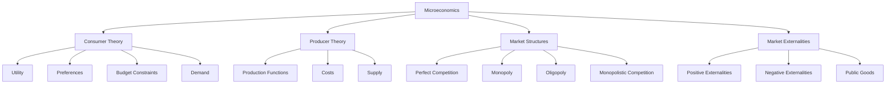

```mermaid
flowchart TD
    MICRO[Microeconomics] --> CT[Consumer Theory]
    MICRO --> PT[Producer Theory]
    MICRO --> MS[Market Structures]
    MICRO --> ME[Market Externalities]

    CT --> U[Utility]
    CT --> P[Preferences]
    CT --> BC[Budget Constraints]
    CT --> D[Demand]

    PT --> PF[Production Functions]
    PT --> C[Costs]
    PT --> S[Supply]

    MS --> PC[Perfect Competition]
    MS --> M[Monopoly]
    MS --> O[Oligopoly]
    MS --> MC[Monopolistic Competition]

    ME --> PV[Positive Externalities]
    ME --> NV[Negative Externalities]
    ME --> PG[Public Goods]
```
