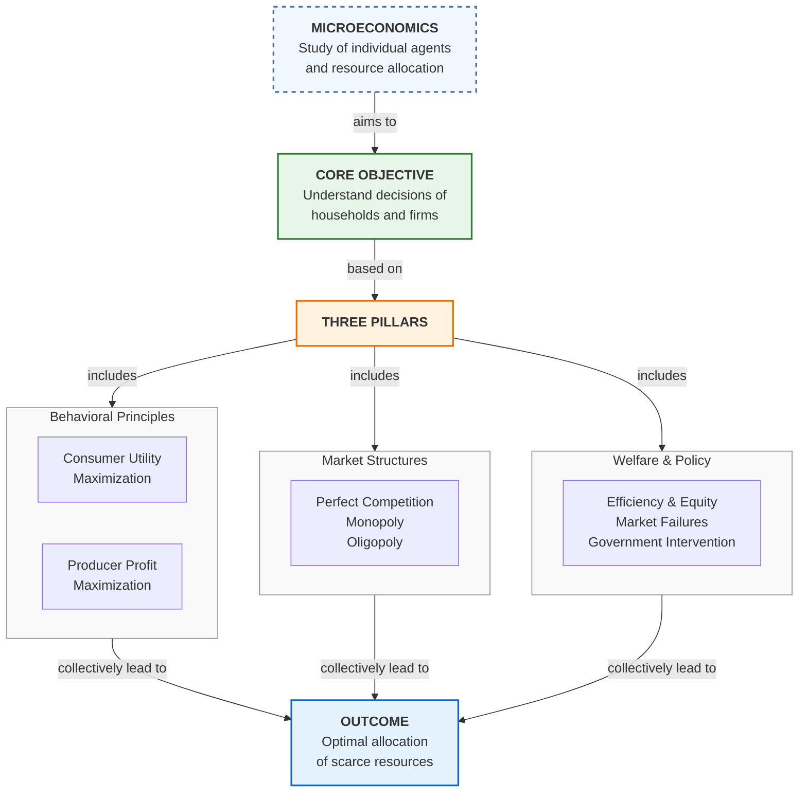

```mermaid
flowchart TD
    A[<b>MICROECONOMICS</b><br>Study of individual agents<br>and resource allocation]:::title
    B[<b>CORE OBJECTIVE</b><br>Understand decisions of<br>households and firms]:::objective
    C[<b>THREE PILLARS</b>]:::pillars
    subgraph principles [Behavioral Principles]
        C1[Consumer Utility<br>Maximization]
        C2[Producer Profit<br>Maximization]
    end
    subgraph structures [Market Structures]
        C3[Perfect Competition<br>Monopoly<br>Oligopoly]
    end
    subgraph welfare [Welfare & Policy]
        C4[Efficiency & Equity<br>Market Failures<br>Government Intervention]
    end
    D[<b>OUTCOME</b><br>Optimal allocation<br>of scarce resources]:::outcome
    A -->|aims to| B
    B -->|based on| C
    C -->|includes| principles
    C -->|includes| structures
    C -->|includes| welfare
    principles & structures & welfare -->|collectively lead to| D
    classDef title fill:#f0f7ff,stroke:#4a6fa5,stroke-width:2px,color:#333,stroke-dasharray:5 5
    classDef objective fill:#e8f5e9,stroke:#2e7d32,stroke-width:2px,color:#333
    classDef pillars fill:#fff3e0,stroke:#ef6c00,stroke-width:2px,color:#333
    classDef outcome fill:#e3f2fd,stroke:#1565c0,stroke-width:2px,color:#333
    style principles fill:#f9f9f9,stroke:#888,stroke-width:1px,color:#333
    style structures fill:#f9f9f9,stroke:#888,stroke-width:1px,color:#333
    style welfare fill:#f9f9f9,stroke:#888,stroke-width:1px,color:#333
```
