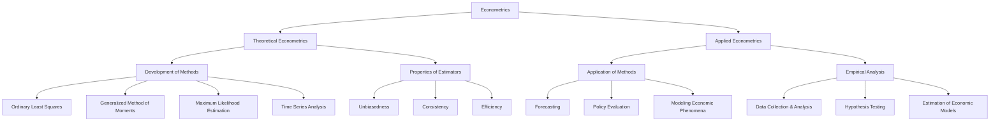

```mermaid
flowchart TD
    ECON[Econometrics] --> TM[Theoretical Econometrics]
    ECON --> AE[Applied Econometrics]

    TM --> DEV[Development of Methods]
    TM --> PROP[Properties of Estimators]

    AE --> APP[Application of Methods]
    AE --> EMP[Empirical Analysis]

    DEV --> OLS[Ordinary Least Squares]
    DEV --> GMM[Generalized Method of Moments]
    DEV --> MLE[Maximum Likelihood Estimation]
    DEV --> TS[Time Series Analysis]

    PROP --> U[Unbiasedness]
    PROP --> C[Consistency]
    PROP --> E[Efficiency]

    APP --> F[Forecasting]
    APP --> PE[Policy Evaluation]
    APP --> M[Modeling Economic Phenomena]

    EMP --> DATA[Data Collection & Analysis]
    EMP --> HYP[Hypothesis Testing]
    EMP --> EST[Estimation of Economic Models]
```
