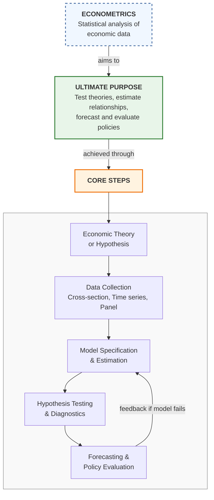

```mermaid
flowchart TD
    A[<b>ECONOMETRICS</b><br>Statistical analysis of<br>economic data]:::title
    B[<b>ULTIMATE PURPOSE</b><br>Test theories, estimate relationships,<br>forecast and evaluate policies]:::purpose
    C[<b>CORE STEPS</b>]:::steps
    subgraph steps [ ]
        D[Economic Theory<br>or Hypothesis]
        E[Data Collection<br>Cross‑section, Time series, Panel]
        F[Model Specification<br>& Estimation]
        G[Hypothesis Testing<br>& Diagnostics]
        H[Forecasting &<br>Policy Evaluation]
    end
    A -->|aims to| B
    B -->|achieved through| C
    C --> D
    D --> E
    E --> F
    F --> G
    G --> H
    H -->|feedback if model fails| F
    classDef title fill:#f0f7ff,stroke:#4a6fa5,stroke-width:2px,color:#333,stroke-dasharray: 5 5
    classDef purpose fill:#e8f5e9,stroke:#2e7d32,stroke-width:2px,color:#333
    classDef steps fill:#fff3e0,stroke:#ef6c00,stroke-width:2px,color:#333
    style steps fill:#f9f9f9,stroke:#888,stroke-width:1px,color:#333
```
