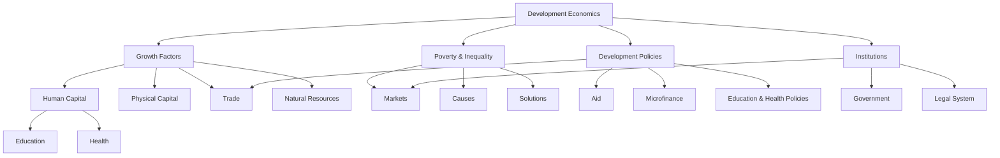

```mermaid
flowchart TD
    DE[Development Economics] --> GF[Growth Factors]
    DE --> POV[Poverty & Inequality]
    DE --> POL[Development Policies]
    DE --> I[Institutions]

    GF --> HC[Human Capital]
    GF --> PC[Physical Capital]
    GF --> T[Technology]
    GF --> NR[Natural Resources]

    HC --> ED[Education]
    HC --> H[Health]

    POV --> M[Measurement]
    POV --> C[Causes]
    POV --> S[Solutions]

    POL --> A[Aid]
    POL --> T[Trade]
    POL --> MI[Microfinance]
    POL --> E[Education & Health Policies]

    I --> G[Government]
    I --> L[Legal System]
    I --> M[Markets]
```
