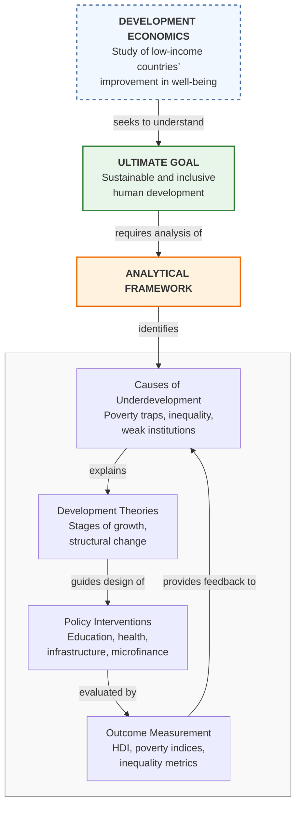

```mermaid
flowchart TD
    A[<b>DEVELOPMENT ECONOMICS</b><br>Study of low‑income countries’<br>improvement in well‑being]:::title
    B[<b>ULTIMATE GOAL</b><br>Sustainable and inclusive<br>human development]:::goal
    C[<b>ANALYTICAL FRAMEWORK</b>]:::framework
    subgraph framework [ ]
        D[Causes of Underdevelopment<br>Poverty traps, inequality,<br>weak institutions]
        E[Development Theories<br>Stages of growth,<br>structural change]
        F[Policy Interventions<br>Education, health,<br>infrastructure, microfinance]
        G[Outcome Measurement<br>HDI, poverty indices,<br>inequality metrics]
    end
    A -->|seeks to understand| B
    B -->|requires analysis of| C
    C -->|identifies| D
    D -->|explains| E
    E -->|guides design of| F
    F -->|evaluated by| G
    G -->|provides feedback to| D
    classDef title fill:#f0f7ff,stroke:#4a6fa5,stroke-width:2px,color:#333,stroke-dasharray: 5 5
    classDef goal fill:#e8f5e9,stroke:#2e7d32,stroke-width:2px,color:#333
    classDef framework fill:#fff3e0,stroke:#ef6c00,stroke-width:2px,color:#333
    style framework fill:#f9f9f9,stroke:#888,stroke-width:1px,color:#333
```
