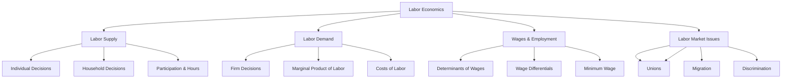

```mermaid
flowchart TD
    LE[Labor Economics] --> LS[Labor Supply]
    LE --> LD[Labor Demand]
    LE --> WE[Wages & Employment]
    LE --> LM[Labor Market Issues]

    LS --> I[Individual Decisions]
    LS --> HH[Household Decisions]
    LS --> P[Participation & Hours]

    LD --> F[Firm Decisions]
    LD --> MP[Marginal Product of Labor]
    LD --> C[Costs of Labor]

    WE --> DET[Determinants of Wages]
    WE --> WD[Wage Differentials]
    WE --> MIN[Minimum Wage]

    LM --> U[Unemployment]
    LM --> M[Migration]
    LM --> D[Discrimination]
    LM --> U[Unions]
```
