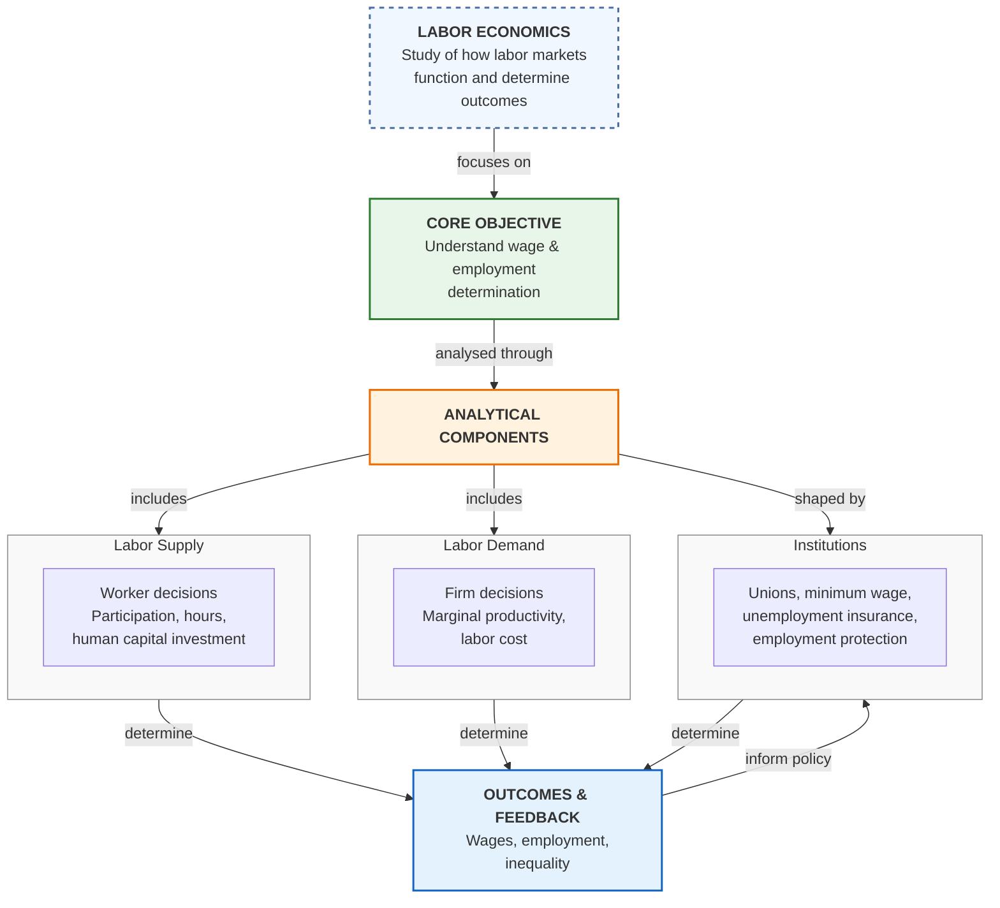

```mermaid
flowchart TD
    A[<b>LABOR ECONOMICS</b><br>Study of how labor markets<br>function and determine outcomes]:::title
    B[<b>CORE OBJECTIVE</b><br>Understand wage & employment<br>determination]:::objective
    C[<b>ANALYTICAL COMPONENTS</b>]:::components
    subgraph supply [Labor Supply]
        C1[Worker decisions<br>Participation, hours,<br>human capital investment]
    end
    subgraph demand [Labor Demand]
        C2[Firm decisions<br>Marginal productivity,<br>labor cost]
    end
    subgraph institutions [Institutions]
        C3[Unions, minimum wage,<br>unemployment insurance,<br>employment protection]
    end
    D[<b>OUTCOMES & FEEDBACK</b><br>Wages, employment,<br>inequality]:::outcome
    A -->|focuses on| B
    B -->|analysed through| C
    C -->|includes| supply
    C -->|includes| demand
    C -->|shaped by| institutions
    supply & demand & institutions -->|determine| D
    D -->|inform policy| institutions
    classDef title fill:#f0f7ff,stroke:#4a6fa5,stroke-width:2px,color:#333,stroke-dasharray:5 5
    classDef objective fill:#e8f5e9,stroke:#2e7d32,stroke-width:2px,color:#333
    classDef components fill:#fff3e0,stroke:#ef6c00,stroke-width:2px,color:#333
    classDef outcome fill:#e3f2fd,stroke:#1565c0,stroke-width:2px,color:#333
    style supply fill:#f9f9f9,stroke:#888,stroke-width:1px,color:#333
    style demand fill:#f9f9f9,stroke:#888,stroke-width:1px,color:#333
    style institutions fill:#f9f9f9,stroke:#888,stroke-width:1px,color:#333
```
