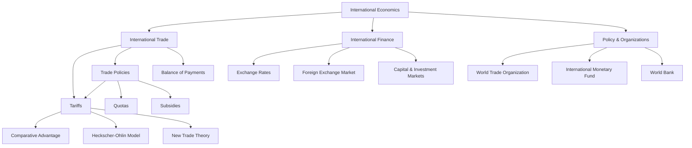

```mermaid
flowchart TD
    IE[International Economics] --> IT[International Trade]
    IE --> IF[International Finance]
    IE --> PO[Policy & Organizations]

    IT --> T[Trade Theories]
    IT --> TP[Trade Policies]
    IT --> BOP[Balance of Payments]

    T --> CA[Comparative Advantage]
    T --> HO[Heckscher-Ohlin Model]
    T --> NTT[New Trade Theory]

    TP --> T[Tariffs]
    TP --> Q[Quotas]
    TP --> S[Subsidies]

    IF --> ER[Exchange Rates]
    IF --> F[Foreign Exchange Market]
    IF --> CIM[Capital & Investment Markets]

    PO --> WTO[World Trade Organization]
    PO --> IMF[International Monetary Fund]
    PO --> WB[World Bank]
```
