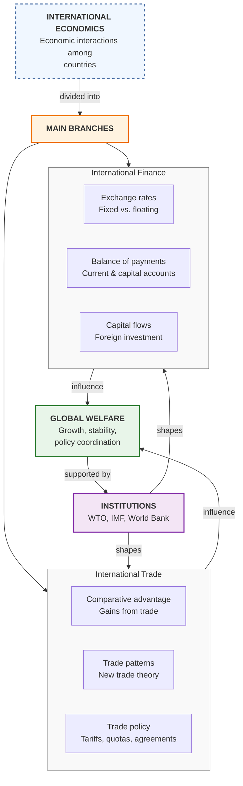

```mermaid
flowchart TD
    A[<b>INTERNATIONAL ECONOMICS</b><br>Economic interactions among<br>countries]:::title
    B[<b>MAIN BRANCHES</b>]:::branches
    subgraph trade [International Trade]
        C1[Comparative advantage<br>Gains from trade]
        C2[Trade patterns<br>New trade theory]
        C3[Trade policy<br>Tariffs, quotas, agreements]
    end
    subgraph finance [International Finance]
        C4[Exchange rates<br>Fixed vs. floating]
        C5[Balance of payments<br>Current & capital accounts]
        C6[Capital flows<br>Foreign investment]
    end
    D[<b>GLOBAL WELFARE</b><br>Growth, stability,<br>policy coordination]:::welfare
    E[<b>INSTITUTIONS</b><br>WTO, IMF, World Bank]:::institutions
    A -->|divided into| B
    B --> trade
    B --> finance
    trade & finance -->|influence| D
    D -->|supported by| E
    E -->|shapes| trade
    E -->|shapes| finance
    classDef title fill:#f0f7ff,stroke:#4a6fa5,stroke-width:2px,color:#333,stroke-dasharray:5 5
    classDef branches fill:#fff3e0,stroke:#ef6c00,stroke-width:2px,color:#333
    classDef welfare fill:#e8f5e9,stroke:#2e7d32,stroke-width:2px,color:#333
    classDef institutions fill:#f3e5f5,stroke:#7b1fa2,stroke-width:2px,color:#333
    style trade fill:#f9f9f9,stroke:#888,stroke-width:1px,color:#333
    style finance fill:#f9f9f9,stroke:#888,stroke-width:1px,color:#333
```
