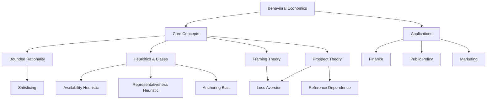

```mermaid
flowchart TD
    BE[Behavioral Economics] --> CR[Core Concepts]
    BE --> APP[Applications]

    CR --> BR[Bounded Rationality]
    CR --> H[Heuristics & Biases]
    CR --> FT[Framing Theory]
    CR --> PT[Prospect Theory]

    BR --> S[Satisficing]
    H --> AH[Availability Heuristic]
    H --> RH[Representativeness Heuristic]
    H --> AB[Anchoring Bias]

    FT --> LA[Loss Aversion]
    PT --> RD[Reference Dependence]
    PT --> LA

    APP --> FIN[Finance]
    APP --> PP[Public Policy]
    APP --> MKT[Marketing]
```
