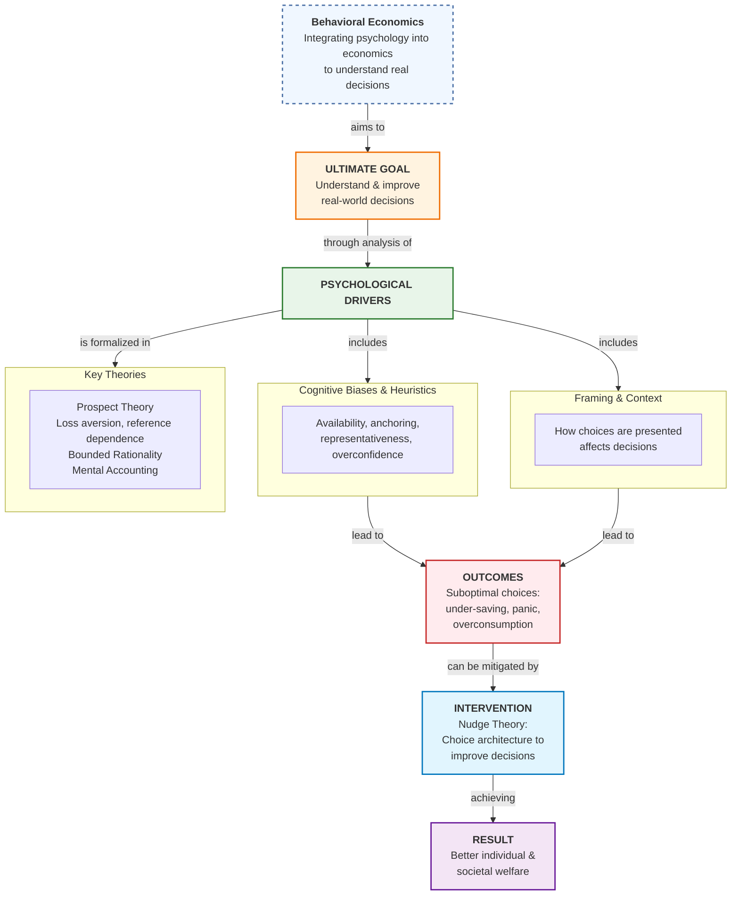

```mermaid
flowchart TD
    A[<b>Behavioral Economics</b><br>Integrating psychology into economics<br>to understand real decisions]:::titulo
    B[<b>ULTIMATE GOAL</b><br>Understand & improve<br>real-world decisions]:::goal
    C[<b>PSYCHOLOGICAL DRIVERS</b>]:::drivers
    subgraph D[Cognitive Biases & Heuristics]
        D1[Availability, anchoring,<br>representativeness, overconfidence]
    end
    subgraph E[Framing & Context]
        E1[How choices are presented<br>affects decisions]
    end
    subgraph F[Key Theories]
        F1[Prospect Theory<br>Loss aversion, reference dependence<br>Bounded Rationality<br>Mental Accounting]
    end
    G[<b>OUTCOMES</b><br>Suboptimal choices:<br>under-saving, panic,<br>overconsumption]:::outcomes
    H[<b>INTERVENTION</b><br>Nudge Theory:<br>Choice architecture to<br>improve decisions]:::intervention
    I[<b>RESULT</b><br>Better individual &<br>societal welfare]:::result

    A -->|aims to| B
    B -->|through analysis of| C
    C -->|includes| D
    C -->|includes| E
    C -->|is formalized in| F
    D & E -->|lead to| G
    G -->|can be mitigated by| H
    H -->|achieving| I

    classDef titulo fill:#f0f7ff,stroke:#4a6fa5,stroke-width:2px,color:#333,stroke-dasharray: 5 5
    classDef goal fill:#fff3e0,stroke:#ef6c00,stroke-width:2px,color:#333
    classDef drivers fill:#e8f5e9,stroke:#2e7d32,stroke-width:2px,color:#333
    classDef outcomes fill:#ffebee,stroke:#c62828,stroke-width:2px,color:#333
    classDef intervention fill:#e1f5fe,stroke:#0277bd,stroke-width:2px,color:#333
    classDef result fill:#f3e5f5,stroke:#6a1b9a,stroke-width:2px,color:#333
```
