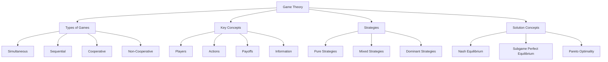

```mermaid
flowchart TD
    GT[Game Theory] --> TG[Types of Games]
    GT --> KC[Key Concepts]
    GT --> STR[Strategies]
    GT --> SOL[Solution Concepts]

    TG --> S[Simultaneous]
    TG --> SEQ[Sequential]
    TG --> C[Cooperative]
    TG --> NC[Non-Cooperative]

    KC --> P[Players]
    KC --> A[Actions]
    KC --> PAY[Payoffs]
    KC --> I[Information]

    STR --> PS[Pure Strategies]
    STR --> MS[Mixed Strategies]
    STR --> DS[Dominant Strategies]

    SOL --> NE[Nash Equilibrium]
    SOL --> SPE[Subgame Perfect Equilibrium]
    SOL --> PARETO[Pareto Optimality]
```
