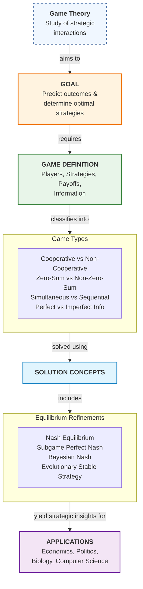

```mermaid
flowchart TD
    A[<b>Game Theory</b><br>Study of strategic<br>interactions]:::titulo
    B[<b>GOAL</b><br>Predict outcomes &<br>determine optimal strategies]:::goal
    C[<b>GAME DEFINITION</b><br>Players, Strategies, Payoffs,<br>Information]:::definition
    subgraph D[Game Types]
        D1[Cooperative vs Non-Cooperative<br>Zero-Sum vs Non-Zero-Sum<br>Simultaneous vs Sequential<br>Perfect vs Imperfect Info]
    end
    E[<b>SOLUTION CONCEPTS</b>]:::solutions
    subgraph F[Equilibrium Refinements]
        F1[Nash Equilibrium<br>Subgame Perfect Nash<br>Bayesian Nash<br>Evolutionary Stable Strategy]
    end
    G[<b>APPLICATIONS</b><br>Economics, Politics,<br>Biology, Computer Science]:::applications

    A -->|aims to| B
    B -->|requires| C
    C -->|classifies into| D
    D -->|solved using| E
    E -->|includes| F
    F -->|yield strategic insights for| G

    classDef titulo fill:#f0f7ff,stroke:#4a6fa5,stroke-width:2px,color:#333,stroke-dasharray: 5 5
    classDef goal fill:#fff3e0,stroke:#ef6c00,stroke-width:2px,color:#333
    classDef definition fill:#e8f5e9,stroke:#2e7d32,stroke-width:2px,color:#333
    classDef solutions fill:#e1f5fe,stroke:#0277bd,stroke-width:2px,color:#333
    classDef applications fill:#f3e5f5,stroke:#6a1b9a,stroke-width:2px,color:#333
```
