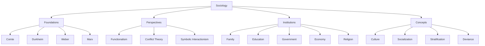

```mermaid
flowchart TD
    S[Sociology] --> F[Foundations]
    S --> P[Perspectives]
    S --> I[Institutions]
    S --> C[Concepts]

    F --> COM[Comte]
    F --> DUR[Durkheim]
    F --> WEB[Weber]
    F --> MAR[Marx]

    P --> FUNC[Functionalism]
    P --> CON[Conflict Theory]
    P --> SYM[Symbolic Interactionism]

    I --> FAM[Family]
    I --> EDU[Education]
    I --> GOV[Government]
    I --> ECO[Economy]
    I --> REL[Religion]

    C --> CUL[Culture]
    C --> SOC[Socialization]
    C --> STR[Stratification]
    C --> DEV[Deviance]
```
