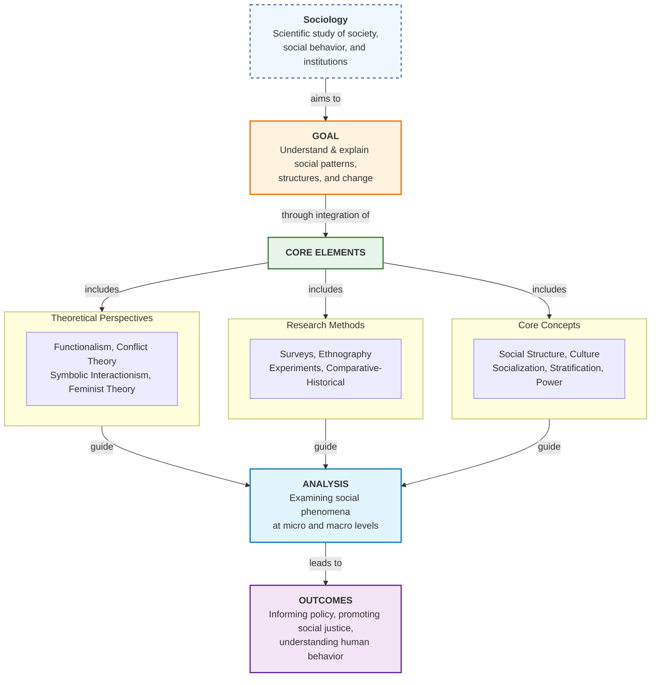

```mermaid
flowchart TD
    A[<b>Sociology</b><br>Scientific study of society,<br>social behavior, and institutions]:::title
    B[<b>GOAL</b><br>Understand & explain social patterns,<br>structures, and change]:::goal
    C[<b>CORE ELEMENTS</b>]:::core
    subgraph D[Theoretical Perspectives]
        D1[Functionalism, Conflict Theory<br>Symbolic Interactionism, Feminist Theory]
    end
    subgraph E[Research Methods]
        E1[Surveys, Ethnography<br>Experiments, Comparative-Historical]
    end
    subgraph F[Core Concepts]
        F1[Social Structure, Culture<br>Socialization, Stratification, Power]
    end
    G[<b>ANALYSIS</b><br>Examining social phenomena<br>at micro and macro levels]:::analysis
    H[<b>OUTCOMES</b><br>Informing policy, promoting social justice,<br>understanding human behavior]:::outcome

    A -->|aims to| B
    B -->|through integration of| C
    C -->|includes| D
    C -->|includes| E
    C -->|includes| F
    D & E & F -->|guide| G
    G -->|leads to| H

    classDef title fill:#f0f7ff,stroke:#4a6fa5,stroke-width:2px,color:#333,stroke-dasharray: 5 5
    classDef goal fill:#fff3e0,stroke:#ef6c00,stroke-width:2px,color:#333
    classDef core fill:#e8f5e9,stroke:#2e7d32,stroke-width:2px,color:#333
    classDef analysis fill:#e1f5fe,stroke:#0277bd,stroke-width:2px,color:#333
    classDef outcome fill:#f3e5f5,stroke:#6a1b9a,stroke-width:2px,color:#333
```
