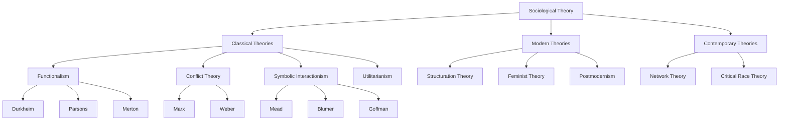

```mermaid
flowchart TD
    ST[Sociological Theory] --> CT[Classical Theories]
    ST --> MT[Modern Theories]
    ST --> CONT[Contemporary Theories]

    CT --> F[Functionalism]
    CT --> CT2[Conflict Theory]
    CT --> SI[Symbolic Interactionism]
    CT --> UT[Utilitarianism]

    F --> D[Durkheim]
    F --> P[Parsons]
    F --> M[Merton]

    CT2 --> M2[Marx]
    CT2 --> W[Weber]

    SI --> M3[Mead]
    SI --> B[Blumer]
    SI --> G[Goffman]

    MT --> ST2[Structuration Theory]
    MT --> FT[Feminist Theory]
    MT --> PM[Postmodernism]

    CONT --> NET[Network Theory]
    CONT --> CRIT[Critical Race Theory]
```
