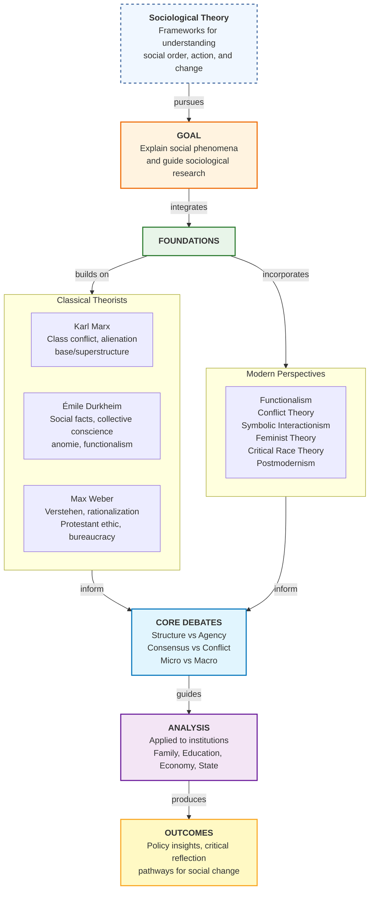

```mermaid
flowchart TD
    A[<b>Sociological Theory</b><br>Frameworks for understanding<br>social order, action, and change]:::title
    B[<b>GOAL</b><br>Explain social phenomena<br>and guide sociological research]:::goal
    C[<b>FOUNDATIONS</b>]:::foundations
    subgraph D[Classical Theorists]
        D1[Karl Marx<br>Class conflict, alienation<br>base/superstructure]
        D2[Émile Durkheim<br>Social facts, collective conscience<br>anomie, functionalism]
        D3[Max Weber<br>Verstehen, rationalization<br>Protestant ethic, bureaucracy]
    end
    subgraph E[Modern Perspectives]
        E1[Functionalism<br>Conflict Theory<br>Symbolic Interactionism<br>Feminist Theory<br>Critical Race Theory<br>Postmodernism]
    end
    F[<b>CORE DEBATES</b><br>Structure vs Agency<br>Consensus vs Conflict<br>Micro vs Macro]:::debates
    G[<b>ANALYSIS</b><br>Applied to institutions<br>Family, Education, Economy, State]:::analysis
    H[<b>OUTCOMES</b><br>Policy insights, critical reflection<br>pathways for social change]:::outcome

    A -->|pursues| B
    B -->|integrates| C
    C -->|builds on| D
    C -->|incorporates| E
    D & E -->|inform| F
    F -->|guides| G
    G -->|produces| H

    classDef title fill:#f0f7ff,stroke:#4a6fa5,stroke-width:2px,color:#333,stroke-dasharray: 5 5
    classDef goal fill:#fff3e0,stroke:#ef6c00,stroke-width:2px,color:#333
    classDef foundations fill:#e8f5e9,stroke:#2e7d32,stroke-width:2px,color:#333
    classDef debates fill:#e1f5fe,stroke:#0277bd,stroke-width:2px,color:#333
    classDef analysis fill:#f3e5f5,stroke:#6a1b9a,stroke-width:2px,color:#333
    classDef outcome fill:#fff9c4,stroke:#f9a825,stroke-width:2px,color:#333
```
