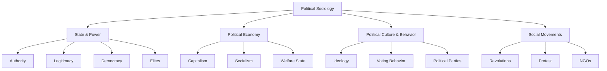

```mermaid
flowchart TD
    PS[Political Sociology] --> SP[State & Power]
    PS --> PE[Political Economy]
    PS --> PC[Political Culture & Behavior]
    PS --> SM[Social Movements]

    SP --> AUTH[Authority]
    SP --> LEG[Legitimacy]
    SP --> DEM[Democracy]
    SP --> EL[Elites]

    PE --> CAP[Capitalism]
    PE --> SOC[Socialism]
    PE --> WEL[Welfare State]

    PC --> IDE[Ideology]
    PC --> VOTE[Voting Behavior]
    PC --> PART[Political Parties]

    SM --> REV[Revolutions]
    SM --> PRO[Protest]
    SM --> NGO[NGOs]
```
