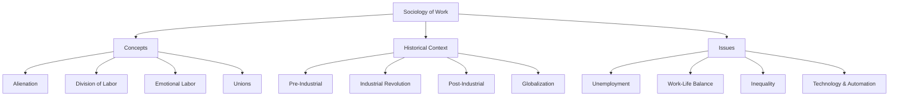

```mermaid
flowchart TD
    SW[Sociology of Work] --> C[Concepts]
    SW --> H[Historical Context]
    SW --> I[Issues]

    C --> AL[Alienation]
    C --> DL[Division of Labor]
    C --> EM[Emotional Labor]
    C --> UN[Unions]

    H --> PC[Pre-Industrial]
    H --> IND[Industrial Revolution]
    H --> PI[Post-Industrial]
    H --> GL[Globalization]

    I --> UNEMP[Unemployment]
    I --> WI[Work-Life Balance]
    I --> INEQ[Inequality]
    I --> TECH[Technology & Automation]
```
