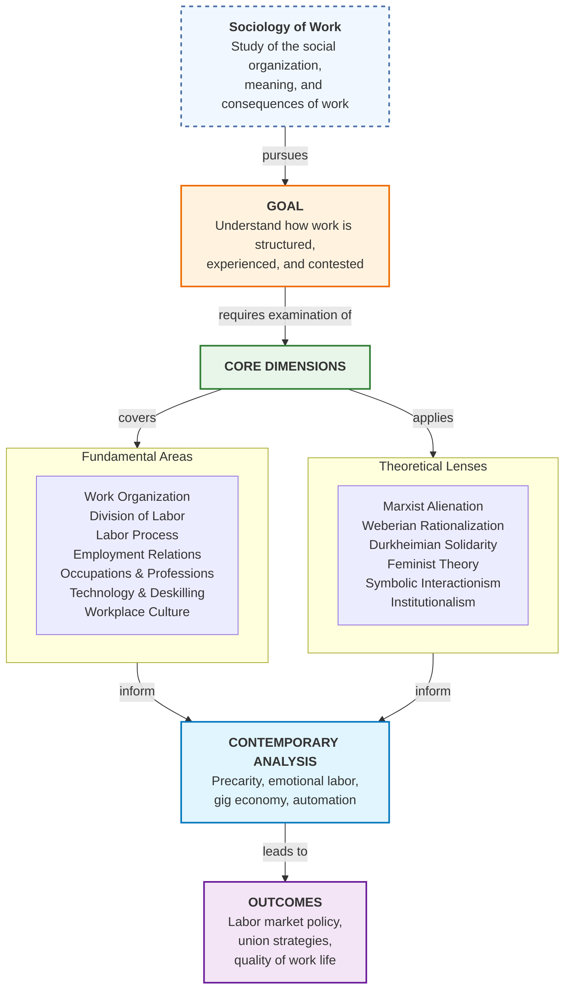

```mermaid
flowchart TD
    A[<b>Sociology of Work</b><br>Study of the social organization,<br>meaning, and consequences of work]:::title
    B[<b>GOAL</b><br>Understand how work is structured,<br>experienced, and contested]:::goal
    C[<b>CORE DIMENSIONS</b>]:::dimensions
    subgraph D[Fundamental Areas]
        D1[Work Organization<br>Division of Labor<br>Labor Process<br>Employment Relations<br>Occupations & Professions<br>Technology & Deskilling<br>Workplace Culture]
    end
    subgraph E[Theoretical Lenses]
        E1[Marxist Alienation<br>Weberian Rationalization<br>Durkheimian Solidarity<br>Feminist Theory<br>Symbolic Interactionism<br>Institutionalism]
    end
    F[<b>CONTEMPORARY ANALYSIS</b><br>Precarity, emotional labor,<br>gig economy, automation]:::analysis
    G[<b>OUTCOMES</b><br>Labor market policy,<br>union strategies,<br>quality of work life]:::outcome

    A -->|pursues| B
    B -->|requires examination of| C
    C -->|covers| D
    C -->|applies| E
    D & E -->|inform| F
    F -->|leads to| G

    classDef title fill:#f0f7ff,stroke:#4a6fa5,stroke-width:2px,color:#333,stroke-dasharray: 5 5
    classDef goal fill:#fff3e0,stroke:#ef6c00,stroke-width:2px,color:#333
    classDef dimensions fill:#e8f5e9,stroke:#2e7d32,stroke-width:2px,color:#333
    classDef analysis fill:#e1f5fe,stroke:#0277bd,stroke-width:2px,color:#333
    classDef outcome fill:#f3e5f5,stroke:#6a1b9a,stroke-width:2px,color:#333
```
