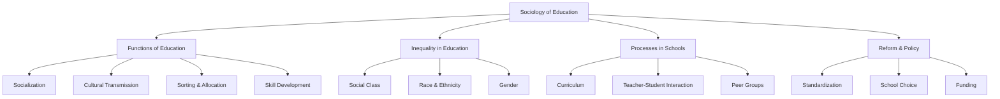

```mermaid
flowchart TD
    SE[Sociology of Education] --> F[Functions of Education]
    SE --> I[Inequality in Education]
    SE --> P[Processes in Schools]
    SE --> R[Reform & Policy]

    F --> SOC[Socialization]
    F --> CUL[Cultural Transmission]
    F --> SORT[Sorting & Allocation]
    F --> SKILL[Skill Development]

    I --> CLASS[Social Class]
    I --> RACE[Race & Ethnicity]
    I --> GENDER[Gender]

    P --> CURR[Curriculum]
    P --> INTER[Teacher-Student Interaction]
    P --> PEER[Peer Groups]

    R --> STAND[Standardization]
    R --> CHOICE[School Choice]
    R --> FUND[Funding]
```
