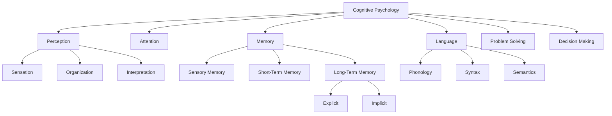

```mermaid
flowchart TD
    CP[Cognitive Psychology] --> P[Perception]
    CP --> A[Attention]
    CP --> M[Memory]
    CP --> L[Language]
    CP --> PROB[Problem Solving]
    CP --> DEC[Decision Making]

    P --> SENS[Sensation]
    P --> ORG[Organization]
    P --> INTER[Interpretation]

    M --> SENS_M[Sensory Memory]
    M --> STM[Short-Term Memory]
    M --> LTM[Long-Term Memory]

    LTM --> EXP[Explicit]
    LTM --> IMP[Implicit]

    L --> PHON[Phonology]
    L --> SYN[Syntax]
    L --> SEM[Semantics]
```
