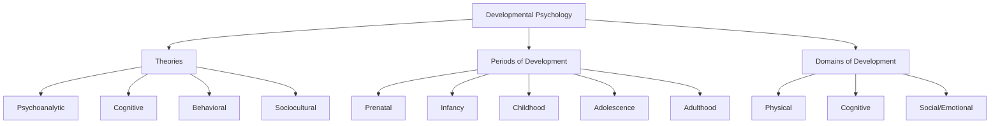

```mermaid
flowchart TD
    DP[Developmental Psychology] --> T[Theories]
    DP --> P[Periods of Development]
    DP --> D[Domains of Development]

    T --> PSY[Psychoanalytic]
    T --> COG[Cognitive]
    T --> BEH[Behavioral]
    T --> SOC[Sociocultural]

    P --> PRE[Prenatal]
    P --> INF[Infancy]
    P --> CHILD[Childhood]
    P --> ADO[Adolescence]
    P --> ADULT[Adulthood]

    D --> PHY[Physical]
    D --> COG2[Cognitive]
    D --> SOC2[Social/Emotional]
```
