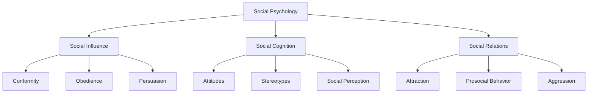

```mermaid
flowchart TD
    SP[Social Psychology] --> SI[Social Influence]
    SP --> SC[Social Cognition]
    SP --> SR[Social Relations]

    SI --> C[Conformity]
    SI --> O[Obedience]
    SI --> P[Persuasion]

    SC --> ATT[Attitudes]
    SC --> ST[Stereotypes]
    SC --> SP2[Social Perception]

    SR --> ATTR[Attraction]
    SR --> PRO[Prosocial Behavior]
    SR --> AGG[Aggression]
```
