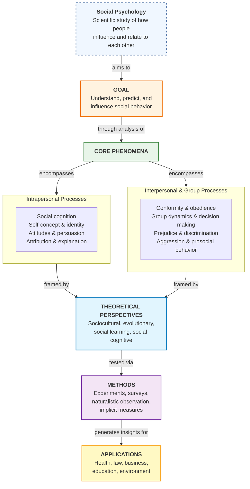

```mermaid
flowchart TD
    A[<b>Social Psychology</b><br>Scientific study of how people<br>influence and relate to each other]:::title
    B[<b>GOAL</b><br>Understand, predict, and<br>influence social behavior]:::goal
    C[<b>CORE PHENOMENA</b>]:::phenomena
    subgraph D[Intrapersonal Processes]
        D1[Social cognition<br>Self-concept & identity<br>Attitudes & persuasion<br>Attribution & explanation]
    end
    subgraph E[Interpersonal & Group Processes]
        E1[Conformity & obedience<br>Group dynamics & decision making<br>Prejudice & discrimination<br>Aggression & prosocial behavior]
    end
    F[<b>THEORETICAL PERSPECTIVES</b><br>Sociocultural, evolutionary,<br>social learning, social cognitive]:::theory
    G[<b>METHODS</b><br>Experiments, surveys,<br>naturalistic observation,<br>implicit measures]:::methods
    H[<b>APPLICATIONS</b><br>Health, law, business,<br>education, environment]:::outcome

    A -->|aims to| B
    B -->|through analysis of| C
    C -->|encompasses| D
    C -->|encompasses| E
    D & E -->|framed by| F
    F -->|tested via| G
    G -->|generates insights for| H

    classDef title fill:#f0f7ff,stroke:#4a6fa5,stroke-width:2px,color:#333,stroke-dasharray: 5 5
    classDef goal fill:#fff3e0,stroke:#ef6c00,stroke-width:2px,color:#333
    classDef phenomena fill:#e8f5e9,stroke:#2e7d32,stroke-width:2px,color:#333
    classDef theory fill:#e1f5fe,stroke:#0277bd,stroke-width:2px,color:#333
    classDef methods fill:#f3e5f5,stroke:#6a1b9a,stroke-width:2px,color:#333
    classDef outcome fill:#fff9c4,stroke:#f9a825,stroke-width:2px,color:#333
```
