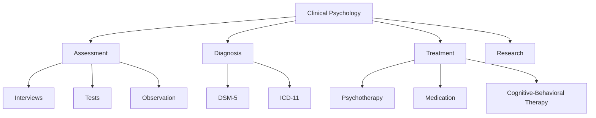

```mermaid
flowchart TD
    CP[Clinical Psychology] --> A[Assessment]
    CP --> D[Diagnosis]
    CP --> T[Treatment]
    CP --> R[Research]

    A --> I[Interviews]
    A --> T2[Tests]
    A --> O[Observation]

    D --> DSM[DSM-5]
    D --> ICD[ICD-11]

    T --> PSY[Psychotherapy]
    T --> MED[Medication]
    T --> CBT[Cognitive-Behavioral Therapy]
```
