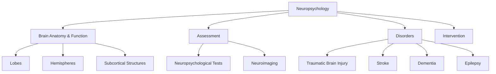

```mermaid
flowchart TD
    NP[Neuropsychology] --> B[Brain Anatomy & Function]
    NP --> A[Assessment]
    NP --> D[Disorders]
    NP --> I[Intervention]

    B --> L[Lobes]
    B --> H[Hemispheres]
    B --> S[Subcortical Structures]

    A --> NT[Neuropsychological Tests]
    A --> NI[Neuroimaging]

    D --> TBI[Traumatic Brain Injury]
    D --> ST[Stroke]
    D --> DEM[Dementia]
    D --> E[Epilepsy]
```
